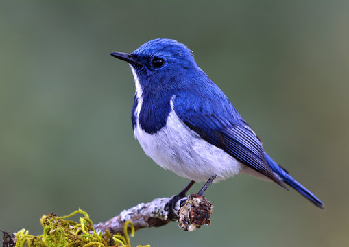
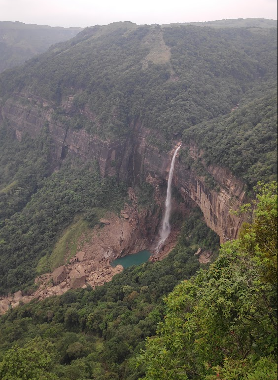
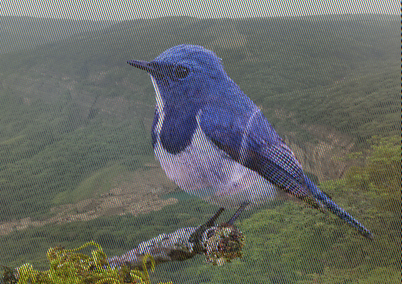

## usage 

```rust
    cargo run -- images/bird.png images/falls.png images/output.png
```
### Image-1

;

### Image-2

;

### Combined imgage of Image-1 and Image-2

;

----

## Code Explanation


### Imports and Module Declaration
```rust
mod args;

use args::Args;
use image::{
  imageops::FilterType::Triangle, io::Reader, DynamicImage, GenericImageView, ImageFormat,
};
```
- `mod args;`: Declares a module named `args`, assumed to be defined in a separate file `args.rs`.
- Imports various functionalities from the `image` crate, which is used for image processing.

### Main Function
```rust
fn main() -> Result<(), ImageDataErrors> {
  let args = Args::new();
  println!("{:?}", args);

  let (image_1, image_1_format) = find_image_from_path(args.image_1);
  let (image_2, image_2_format) = find_image_from_path(args.image_2);

  if image_1_format != image_2_format {
    return Err(ImageDataErrors::DifferentImageFormats);
  }

  let (image_1, image_2) = standardise_size(image_1, image_2);
  let mut output = FloatingImage::new(image_1.width(), image_1.height(), args.output);

  let combined_data = combine_images(image_1, image_2);

  output.set_data(combined_data)?;

  image::save_buffer_with_format(
    output.name,
    &output.data,
    output.width,
    output.height,
    image::ColorType::Rgba8,
    image_1_format,
  )
  .unwrap();
  Ok(())
}
```
1. **Argument Parsing:**
   ```rust
   let args = Args::new();
   ```
   - Creates an `Args` object, which likely parses command-line arguments for image paths and output.

2. **Reading Images:**
   ```rust
   let (image_1, image_1_format) = find_image_from_path(args.image_1);
   let (image_2, image_2_format) = find_image_from_path(args.image_2);
   ```
   - Reads images from provided paths using `find_image_from_path`.

3. **Format Check:**
   ```rust
   if image_1_format != image_2_format {
     return Err(ImageDataErrors::DifferentImageFormats);
   }
   ```
   - Ensures both images have the same format.

4. **Standardize Image Sizes:**
   ```rust
   let (image_1, image_2) = standardise_size(image_1, image_2);
   ```

5. **Create Output Image:**
   ```rust
   let mut output = FloatingImage::new(image_1.width(), image_1.height(), args.output);
   ```

6. **Combine Images:**
   ```rust
   let combined_data = combine_images(image_1, image_2);
   ```

7. **Set Data and Save Image:**
   ```rust
   output.set_data(combined_data)?;

   image::save_buffer_with_format(
     output.name,
     &output.data,
     output.width,
     output.height,
     image::ColorType::Rgba8,
     image_1_format,
   )
   .unwrap();
   ```

### Error Handling Enum
```rust
enum ImageDataErrors {
  BufferTooSmall,
  DifferentImageFormats,
}
```
- Defines possible errors that can occur in the program.

### FloatingImage Struct and Implementation
```rust
struct FloatingImage {
  width: u32,
  height: u32,
  data: Vec<u8>,
  name: String,
}

impl FloatingImage {
  fn new(width: u32, height: u32, name: String) -> Self {
    let buffer_capacity = 3_655_744;
    let buffer: Vec<u8> = Vec::with_capacity(buffer_capacity);
    FloatingImage {
      width,
      height,
      data: buffer,
      name,
    }
  }
  fn set_data(&mut self, data: Vec<u8>) -> Result<(), ImageDataErrors> {
    if data.len() > self.data.capacity() {
      return Err(ImageDataErrors::BufferTooSmall);
    }
    self.data = data;
    Ok(())
  }
}
```
- **FloatingImage Struct:** Holds image dimensions, data, and name.
- **`new` Function:** Initializes a new `FloatingImage` with specified dimensions and name.
- **`set_data` Function:** Sets the image data if it fits within the buffer capacity.

### Image Processing Functions
1. **Find Image from Path:**
   ```rust
   fn find_image_from_path(path: String) -> (DynamicImage, ImageFormat) {
     let image_reader = Reader::open(path).unwrap();
     let image_format = image_reader.format().unwrap();
     let image = image_reader.decode().unwrap();
     (image, image_format)
   }
   ```
   - Reads an image from a given path and returns the image along with its format.

2. **Standardize Size:**
   ```rust
   fn standardise_size(image_1: DynamicImage, image_2: DynamicImage) -> (DynamicImage, DynamicImage) {
     let (width, height) = get_smallest_dimensions(image_1.dimensions(), image_2.dimensions());
     println!("width: {}, height: {}\n", width, height);
     if image_2.dimensions() == (width, height) {
       (image_1.resize_exact(width, height, Triangle), image_2)
     } else {
       (image_1, image_2.resize_exact(width, height, Triangle))
     }
   }
   ```
   - Resizes images to match the smallest dimensions between the two.

3. **Get Smallest Dimensions:**
   ```rust
   fn get_smallest_dimensions(dim_1: (u32, u32), dim_2: (u32, u32)) -> (u32, u32) {
     let pix_1 = dim_1.0 * dim_1.1;
     let pix_2 = dim_2.0 * dim_2.1;
     return if pix_1 < pix_2 { dim_1 } else { dim_2 };
   }
   ```
   - Returns the smallest dimensions between two sets of dimensions.

4. **Combine Images:**
   ```rust
   fn combine_images(image_1: DynamicImage, image_2: DynamicImage) -> Vec<u8> {
     let vec_1 = image_1.to_rgba8().into_vec();
     let vec_2 = image_2.to_rgba8().into_vec();

     alternate_pixels(vec_1, vec_2)
   }
   ```
   - Converts images to RGBA vectors and combines them using `alternate_pixels`.

5. **Alternate Pixels:**
   ```rust
   fn alternate_pixels(vec_1: Vec<u8>, vec_2: Vec<u8>) -> Vec<u8> {
     let mut combined_data = vec![0u8; vec_1.len()];

     let mut i = 0;
     while i < vec_1.len() {
       if i % 8 == 0 {
         combined_data.splice(i..=i + 3, set_rgba(&vec_1, i, i + 3));
       } else {
         combined_data.splice(i..=i + 3, set_rgba(&vec_2, i, i + 3));
       }
       i += 4;
     }

     combined_data
   }
   ```
   - Alternates 4-byte pixel data between two vectors and returns the combined vector.

6. **Set RGBA:**
   ```rust
   fn set_rgba(vec: &Vec<u8>, start: usize, end: usize) -> Vec<u8> {
     let mut rgba = Vec::new();
     for i in start..=end {
       let val = match vec.get(i) {
         Some(d) => *d,
         None => panic!("Index out of bounds"),
       };
       rgba.push(val);
     }
     rgba
   }
   ```
   - Extracts a slice of 4 bytes from the given vector and returns it.

### Summary
This program reads two images, ensures they are of the same format, resizes them to the smallest dimensions, and alternates their pixel data. The result is saved as a new image. The `alternate_pixels` function handles the alternation, and the `FloatingImage` struct manages the image data and saves the combined result.